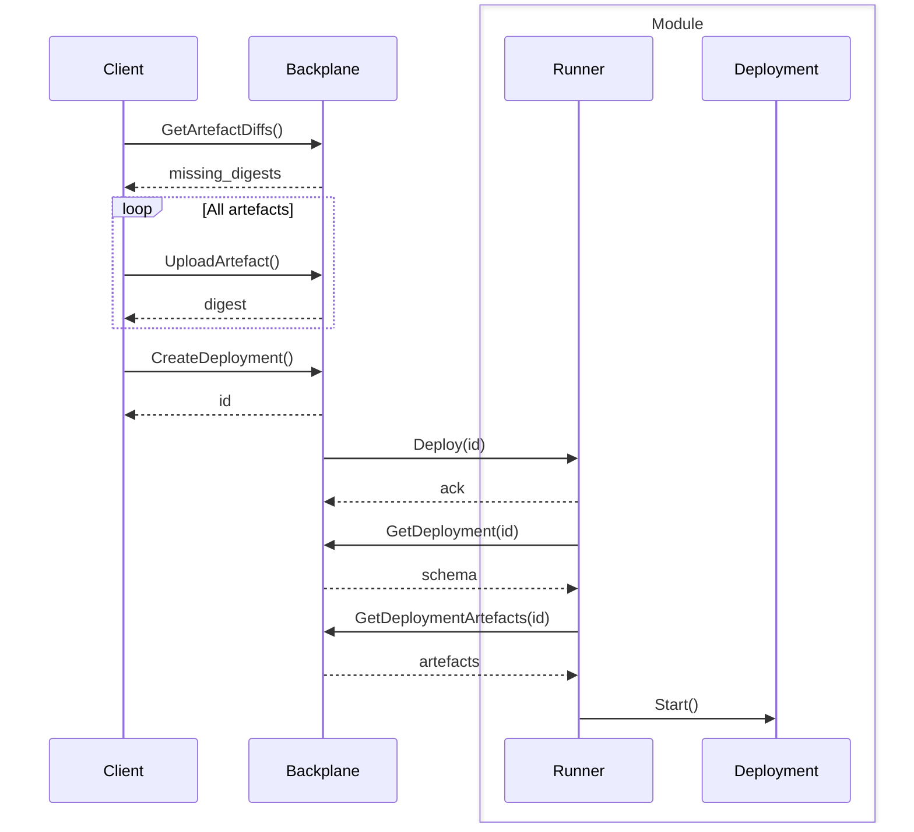
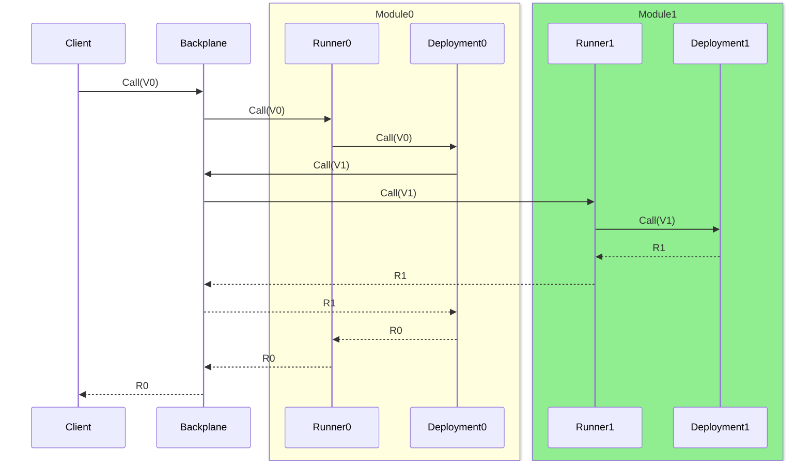

# FTL Architecture

The actors in the diagrams are as follows:

| Actor      | Description                                                                                                |
| ---------- | ---------------------------------------------------------------------------------------------------------- |
| Backplane  | The coordination layer of FTL. This creates and manages Runner instances, routing, resource creation, etc. |
| Platform   | The platform FTL is running on, eg. Kubernetes, VMs, etc.                                                  |
| Runner     | The component of FTL that coordinates with the Backplane to spawn and route to user code.                  |
| Deployment | User code serving VerbService for a module written in a particular language.                               |

## System initialisation

## Creating a deployment

## Routing

This diagram shows a routing example of a client calling verb V0 which calls
verb V1.

