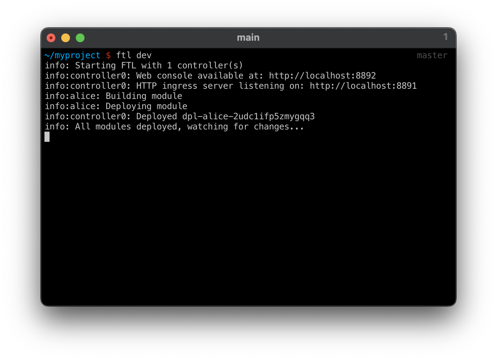
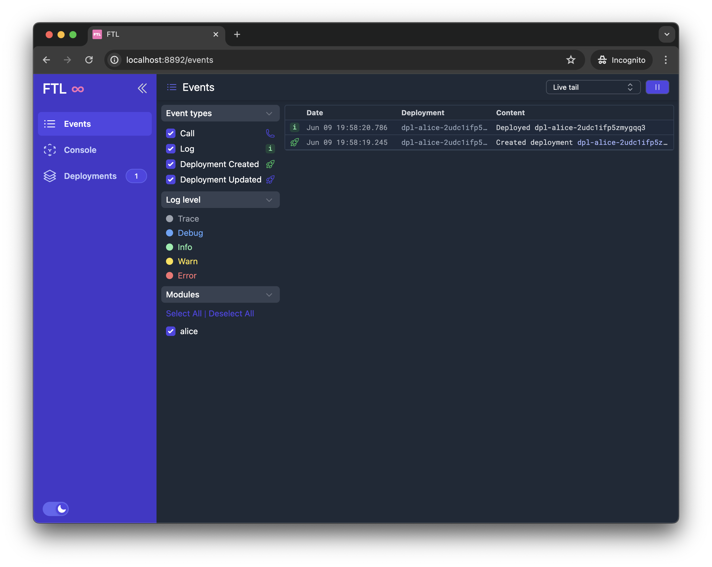
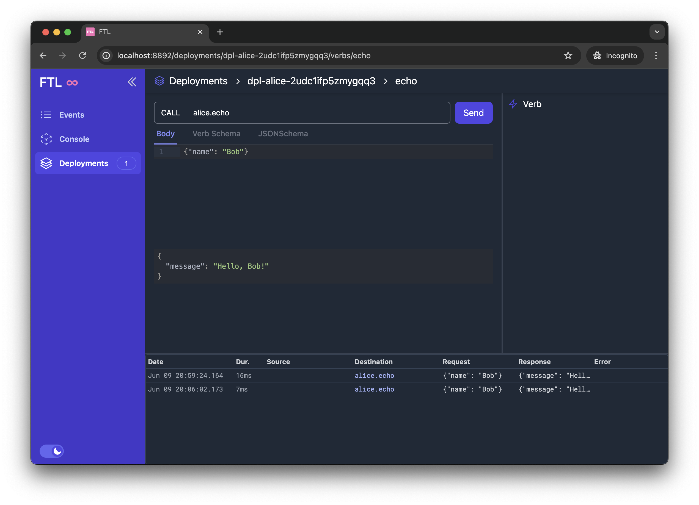
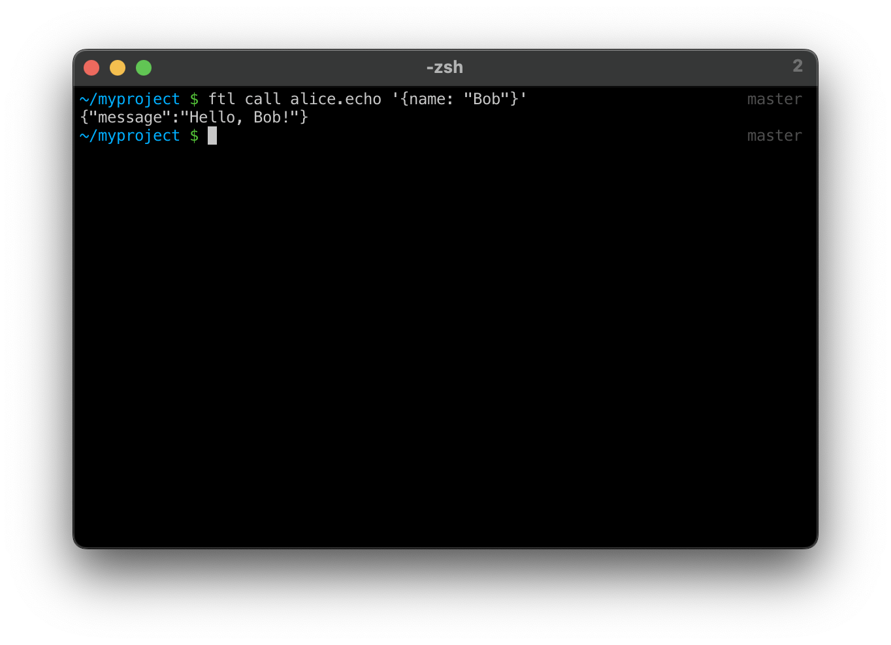

+++
title = "Quick Start"
description = "One page summary of how to start a new FTL project."
date = 2021-05-01T08:20:00+00:00
updated = 2021-05-01T08:20:00+00:00
draft = false
weight = 20
sort_by = "weight"
template = "docs/page.html"

[extra]
lead = "One page summary of how to start a new FTL project."
toc = true
top = false
+++

## Requirements

### Install the FTL CLI

Install the FTL CLI via [Hermit](https://cashapp.github.io/hermit), [Homebrew](https://brew.sh/), or manually.

#### Hermit (Mac or Linux)

FTL can be installed from the main Hermit package repository by simply:

```
hermit install ftl
```

Alternatively you can add [hermit-ftl](https://github.com/TBD54566975/hermit-ftl) to your sources by adding the following to your Hermit environment's `bin/hermit.hcl` file:

```hcl
sources = ["https://github.com/TBD54566975/hermit-ftl.git", "https://github.com/cashapp/hermit-packages.git"]
```

#### Homebrew (Mac or Linux)

```
brew tap TBD54566975/ftl && brew install ftl
```

#### Manually (Mac or Linux)

Download binaries from the [latest release page](https://github.com/TBD54566975/ftl/releases/latest) and place them in your `$PATH`.

### Install the VSCode extension

The [FTL VSCode extension](https://marketplace.visualstudio.com/items?itemName=FTL.ftl) will run FTL within VSCode, and provide LSP support for FTL, displaying errors within the editor.

## Development

### Intitialize an FTL project

Once FTL is installed, initialize an FTL project:

```
mkdir myproject
cd myproject
ftl init myproject . --hermit
```

This will create an `ftl-project.toml` file, a git repository, and a `bin/` directory with Hermit tooling.

### Create a new module

Now that you have an FTL project, create a new module:



<!-- go -->
```
ftl new go . alice
```
This will place the code for the new module `alice` in `myproject/alice/alice.go`:

```go
package alice

import (
	"context"
	"fmt"

	"github.com/TBD54566975/ftl/go-runtime/ftl" // Import the FTL SDK.
)

type EchoRequest struct {
	Name ftl.Option[string] `json:"name"`
}

type EchoResponse struct {
	Message string `json:"message"`
}

//ftl:verb
func Echo(ctx context.Context, req EchoRequest) (EchoResponse, error) {
	return EchoResponse{Message: fmt.Sprintf("Hello, %s!", req.Name.Default("anonymous"))}, nil
}
```

Each module is its own Go module.

<!-- kotlin -->
```
ftl new kotlin . alice
```

This will create a new Maven `pom.xml` based project in the directory `alice` and create new example code in `alice/src/main/kotlin/com/example/EchoVerb.kt`:

```kotlin
package com.example

import xyz.block.ftl.Export
import xyz.block.ftl.Verb


@Export
@Verb
fun echo(req: String): String = "Hello, $req!"
```
<!-- java -->
```
ftl new java . alice
```
This will create a new Maven `pom.xml` based project in the directory `alice` and create new example code in `alice/src/main/java/com/example/EchoVerb.java`:

```java
package com.example;

import xyz.block.ftl.Export;
import xyz.block.ftl.Verb;

public class EchoVerb {

    @Export
    @Verb
    public String echo(String request) {
        return "Hello, " + request + "!";
    }
}
```



Any number of modules can be added to your project, adjacent to each other.

### Start the FTL cluster

#### VSCode

If using VSCode, opening the directory will prompt you to start FTL:

[](vscode.png)

#### Manually

Alternatively start the local FTL development cluster from the command-line:

[](ftldev.png)

This will build and deploy all local modules. Modifying the code will cause `ftl
dev` to rebuild and redeploy the module.

### Open the console

FTL has a console that allows interaction with the cluster topology, logs, traces,
and more. Open a browser window at [https://localhost:8892](https://localhost:8892) to view it:

[](console.png)

### Call your verb

You can call verbs from the console:



Or from a terminal use `ftl call` to call your verb:

[](ftlcall.png)

### Create another module

Create another module and call `alice.echo` from it with by importing the `alice` module and adding the verb client,
`alice.EchoClient`, to the signature of the calling verb. It can be invoked as a function:



<!-- go -->
```go
//ftl:verb
import "ftl/alice"

//ftl:verb
func Other(ctx context.Context, in Request, ec alice.EchoClient) (Response, error) {
    out, err := ec(ctx, alice.EchoRequest{...})
	...
}
```
<!-- kotlin -->
```kotlin
package com.example

import xyz.block.ftl.Export
import xyz.block.ftl.Verb
import ftl.alice.EchoClient


@Export
@Verb
fun other(req: String, echo: EchoClient): String = "Hello from Other , ${echo.call(req)}!"
```
Note that the `EchoClient` is generated by FTL and must be imported. Unfortunately at the moment JVM based languages have
a bit of a chicken-and-egg problem with the generated clients. To force a dependency between the modules you need to add
an import on a class that does not exist yet, and then FTL will generate the client for you. This will be fixed in the future.
<!-- java -->
```java
package com.example.client;

import xyz.block.ftl.Export;
import xyz.block.ftl.Verb;
import ftl.alice.EchoClient;

public class OtherVerb {

    @Export
    @Verb
    public String other(String request, EchoClient echoClient) {
        return "Hello, " + echoClient.call(request) + "!";
    }
}
```
Note that the `EchoClient` is generated by FTL and must be imported. Unfortunately at the moment JVM based languages have
a bit of a chicken-and-egg problem with the generated clients. To force a dependency between the modules you need to add
an import on a class that does not exist yet, and then FTL will generate the client for you. This will be fixed in the future.
<!-- java -->


### What next?

Explore the [reference documentation](../../reference/start/).
